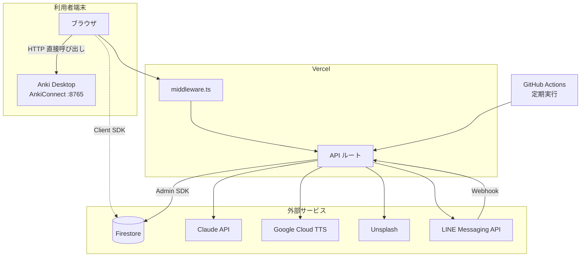

# アーキテクチャ設計書 — AnkiFlow

| 項目 | 内容 |
| --- | --- |
| 文書ID | AF-ARC-001 |
| 版数 | 2.1 |
| 作成日 | 2026-06-21 |
| 最終更新日 | 2026-08-01 |
| 作成者 | [hong-quyen](https://github.com/quyen-doth) |
| ステータス | 運用中 |
| 関連文書 | AF-REQ-001、AF-NFR-001、AF-SEC-001、AF-DB-001、AF-API-001、AF-SCR-001、AF-SET-001 |

## 1. 本書の位置づけ

本書は、AnkiFlow のシステム構成を定義する。対象は、全体構成、処理の実行主体とその境界、ディレクトリ構成、主要なデータの流れ、および設定データの生存期間である。

本書は「どこで何が動くか」を扱う。個別の仕様は各設計書に委ねる。

| 主題 | 参照先 |
| --- | --- |
| 認証・認可の設計 | AF-SEC-001 |
| データ構造 | AF-DB-001 |
| API の仕様 | AF-API-001 |
| 画面の一覧と遷移 | AF-SCR-001 |
| 環境変数と構築手順 | AF-SET-001 |
| 運用手順とスクリプトの実行 | AF-OPS-001 |
| Git 運用 | AF-DEV-001 |

## 2. 全体構成

### 2.1 技術構成

| 層 | 採用技術 |
| --- | --- |
| フレームワーク | Next.js 16 (App Router)、React 19、TypeScript (strict) |
| スタイル | Tailwind CSS v4 |
| データベース | Firebase Firestore |
| 認証 | Firebase Authentication |
| AI | Claude API (`claude-haiku-4-5`) |
| 音声合成 | Google Cloud Text-to-Speech |
| 画像 | Unsplash API |
| Anki 連携 | AnkiConnect (利用者端末) |
| 通知 | LINE Messaging API |
| 検証 | Vitest、独自の検証フレームワーク、Playwright |

### 2.2 構成図



Firestore へは 2 つの経路が存在する。ブラウザからの Client SDK による直接アクセスと、API ルートからの Admin SDK によるアクセスである。前者は Security Rules の適用を受け、後者は受けない。この差は本システムの安全性を左右するため、詳細をセキュリティ設計書 (AF-SEC-001) に定める。

## 3. 実行主体の境界

処理をどこで実行するかは、本システムにおいて最も重要な設計判断である。

| 処理 | 実行主体 | 理由 |
| --- | --- | --- |
| AnkiConnect の呼び出し | **ブラウザ** | Anki は利用者の端末で動作する。サーバーの `localhost` は利用者の端末ではない |
| 外部 AI・音声・画像 API の呼び出し | サーバー | 資格情報をクライアントへ配布しないため |
| Firestore への書き込み | 原則サーバー | 所有者の設定と派生項目の整合を保つため |
| Firestore の読み取り | 双方 | 画面の応答性のため、クライアントからも直接読む |
| 認証状態の検証 | サーバー | Admin SDK が Edge Runtime で動作しないため、API ルートで行う |

### 3.1 AnkiConnect がクライアント側である帰結

**サーバーは AnkiConnect を呼び出さない。** これは制約ではなく前提である。Vercel 上のサーバーにとって `localhost` は自分自身であり、利用者の Anki には到達し得ない。

したがって、Anki を伴う処理は次の形を取る。

```
サーバーがデータを返す
   → ブラウザが AnkiConnect を操作する
       → ブラウザが結果をサーバーへ送り返す
           → サーバーが Firestore を更新する
```

実装は `lib/flashcard-service/client.ts` (接続先の解決) と `lib/flashcard-service/client-ops.ts` (ノートタイプの用意、デッキ操作、ノートの作成と再生成) に集約する。

この形を崩し、サーバーから Anki を呼ぼうとしてはならない。ローカル環境では偶然動作するが、本番では必ず失敗する。

### 3.2 AnkiConnect の接続に関する制約

ブラウザから `localhost:8765` を呼ぶには、AnkiConnect 側で呼び出し元のオリジンを許可する必要がある。設定手順は環境構築手順書 (AF-SET-001) 第 6 章に定める。

接続に失敗した場合、ブラウザは `TypeError: Failed to fetch` を返す。この応答は次の 3 つの状況を区別できない。ブラウザが詳細を JavaScript へ開示しないためである。

| 状況 | 回避の可否 |
| --- | --- |
| Anki Desktop が起動していない | 利用者が起動する |
| オリジンが許可されていない | 利用者が設定する |
| ブラウザのローカルネットワークアクセス制限 | **回避不能** |

3 つ目は、公開されたオリジンから `localhost` への通信をブラウザが遮断する仕組みによる。許可設定を正しても到達しない。アプリケーション側の修正では解決できない。

`lib/flashcard-service/client.ts` の `isLocalNetworkBlockedContext()` および `ankiConnectionErrorMessage()` が、ページのオリジンが loopback であるかによって状況を推定し、案内文を出し分ける。区別できない以上、推定に基づいて**両方の可能性を示す**方針を採る。

Safari は HTTPS のページから `localhost` への接続を許可しない。Anki 連携には使用できない。

## 4. ディレクトリ構成

| パス | 目的 |
| --- | --- |
| `app/api/` | API ルート。サーバー側の処理はすべてここに置く |
| `app/(auth)/` | ログインおよびサインアップ。サイドバーを持たない専用レイアウト |
| `app/dashboard/` | ダッシュボード |
| `app/create/` | カード作成 |
| `app/preview/` | プレビューと編集、Anki への登録 |
| `app/history/` | 作成履歴の一覧と詳細 |
| `app/settings/` | 個人設定。書き込み先は `settings/{uid}` |
| `app/settings/admin/` | 全体設定 (管理者)。書き込み先は `settings/global` |
| `app/admin/` | マスターデータの管理 |
| `components/create/` | コンテンツタイプ定義から構築する共通フォームと各種選択部品 |
| `components/preview/` | プレビューと編集の部品 |
| `components/history/` | 履歴の表と詳細表示 |
| `components/admin/` | 資源ごとの管理部品 |
| `components/layout/` | サイドバーとページヘッダー |
| `components/ui/` | 共有の基本部品 |
| `components/providers/` | React のコンテキスト |
| `lib/` | 共有処理 |
| `lib/ai-agent/` | AI 連携。プロンプト構築、出力プロファイル、スキーマ、プロバイダ |
| `lib/flashcard-service/` | クライアント側の AnkiConnect 連携 |
| `lib/srs/` | 復習期日の算出と優先順位付け |
| `types/index.ts` | 型と列挙型の定義 |
| `scripts/` | 初期投入、移行、権限付与などの運用スクリプト |
| `verify/` | 検証フレームワークと検証仕様 |
| `e2e/` | Playwright による E2E 試験 |
| `middleware.ts` | 経路の保護 (第 1 層) |
| `firestore.rules` | Security Rules |
| `firestore.indexes.json` | 複合インデックスの宣言 |
| `docs/` | 設計文書 |

## 5. データの流れ

### 5.1 カード作成からプレビューまで

| # | 処理 |
| --- | --- |
| 1 | 作成画面が `user_content_types` を所有者で絞り込んで読み、`code` から経路を解決する |
| 2 | 設定の提供部品が `settings/{uid}` から学習言語の一覧と、独立した出力言語の一覧および既定値を読む |
| 3 | `lib/create/formBlueprint.ts` が選択中の定義の `fields[]` から、表示順、ラベル、必須、永続化の可否、および標準の入力部品を構築する |
| 4 | 利用者が共通フォームへ入力する。カードタイプは学習言語と実効出力言語の双方に一致するもののみを表示する。いずれの範囲も未指定のカードタイプは汎用として残す |
| 5 | 送信時に実効出力言語を確定する。`POST /api/generate` が定義の所有者・経路・出力プロファイルをサーバー側で検証し、プロファイルから指示とスキーマを構築して AI を呼ぶ |
| 6 | AI の応答をスキーマで検証し、主項目を入力値で復元し、旧名称の項目を補完する |
| 7 | 結果を `localStorage` へ保存する |
| 8 | プレビュー画面へ遷移して結果を読み込み、画面や操作に由来する情報を AI の生成内容より後に統合したうえで一時保存を消す |
| 9 | 利用者が内容を確認・編集し、登録または保存する |

第 9 段階の分岐を次に示す。

| 状況 | 処理 |
| --- | --- |
| Anki が起動している | ブラウザがメディア保存、ノート構築、デッキ作成、ノート追加を行い、結果を `status: 'synced'` としてサーバーへ送る |
| Anki が起動していない | `status: 'reviewed'` として保存する。後からサイドバーの同期操作でまとめて登録する |

第 5 段階でサーバー側の検証を行う点が重要である。クライアントが送る定義をそのまま信頼しない。ただし、コンテンツタイプ編集画面における試験生成のみは、未保存の定義を明示的に受け付ける専用の経路を持つ。この経路でも認証は通常どおり必要であり、受け取った定義は保存しない。

### 5.2 復習通知

| # | 処理 |
| --- | --- |
| 1 | 利用者が LINE アカウントを連携する |
| 2 | 定期実行が `GET /api/cron/srs-push` を共有シークレット付きで呼ぶ |
| 3 | 通知が有効な利用者を対象に、復習期日を算出して対象を選定する |
| 4 | 利用者ごとのタイムゾーンで配信時刻に該当するかを判定する |
| 5 | 該当する利用者へ配信し、送信済みの記録を更新する |

実行が欠落した場合に備え、直前の時間帯も対象とする補完を行う。同一利用者の同一時刻に対する再送は記録によって抑止する。したがって通知は最大で 1 時間程度遅れて届き得る。

## 6. 設定データの生存期間

コンテンツタイプは 2 つのコレクションに分かれる。この分離は本システムの挙動を理解するうえで欠かせない。

| コレクション | 位置づけ | 編集者 |
| --- | --- | --- |
| `content_types` | 新規利用者へ複製されるグローバルの複製元 | 管理者のみ |
| `user_content_types` | 実行時に参照する利用者ごとの複製 | 各利用者 |

### 6.1 複製の規則

| # | 規則 |
| --- | --- |
| 1 | サインアップ時にグローバルの複製元から利用者のワークスペースへ複製する |
| 2 | 複製は**作成のみ**を行う。既存の複製を更新しない |
| 3 | したがって、**グローバルの既定を変更しても既存利用者には反映されない** |
| 4 | 既存利用者への追加は移行スクリプトで行い、不足分のみを作成する |

規則 3 は意図した設計である。利用者が自分の設定を変更したあとに、管理者の変更で上書きされることを避けるためである。

### 6.2 ルーティング

実行時の経路は、ドキュメント ID ではなく `code` で解決する。複製先のドキュメント ID は複製元と異なるため、ID を経路に用いることができないためである。

| 種別 | 解決方法 |
| --- | --- |
| 組み込み | `code` を `FormType` 列挙型 (`form_language` / `form_it` / `form_general`) へ解決する |
| 独自定義 | 検証済みの `code` をそのまま用いる |

`code` は作成後に変更できない。画面上の制御に加え、Security Rules でも変更を拒否する。

同じ経路へ解決される定義が複数存在する場合、**衝突している定義のみ**を作成および再同期の対象から除外して警告する。衝突していない定義は引き続き利用できる。すべてを止めない方針である。

組み込みの 3 件はいかなる場合も削除できない。削除すると新規利用者の初期データが欠落する。

## 7. 入力状態の保持

`lib/session.ts` が、コンテンツタイプの実行時の経路を鍵として入力状態を `localStorage` に保持する。

| 対象 | 挙動 |
| --- | --- |
| 永続化を宣言した項目 | 生成の成功後も保持する |
| 宣言していない項目 | 生成の成功後に初期化する |
| 定義から削除された項目 | 生成時の送信内容に含めない |
| 入力途中の非永続項目 | 下書きの保持機構が復元する |
| 出力言語の一時的な切り替え | 生成の成功後に個人設定の既定へ戻す |

保持状態はコンテンツタイプごとに独立する。切り替えた場合は切り替え先の状態を読み込む。

## 8. 設計上の判断

本システムの構成を特徴づける判断を示す。検討した代替案および受け入れた制約は、各アーキテクチャ決定記録に詳しい。

| # | 判断 | 理由 | 記録 |
| --- | --- | --- | --- |
| 1 | 出題スケジューリングを自作せず Anki に委ねる | 実績のある実装が存在し、作成の手間の解消に注力するため | [ADR-0001](../adr/0001-delegate-srs-to-anki.md) |
| 2 | AnkiConnect の呼び出しをクライアント側で行う | サーバーから利用者端末の Anki へ到達できないため | [ADR-0002](../adr/0002-client-side-ankiconnect.md) |
| 3 | 認証に httpOnly のセッションクッキーを用いる | ブラウザの JavaScript から読み取れないようにするため | [ADR-0003](../adr/0003-httponly-session-cookie.md) |
| 4 | 認証を 3 層に分ける | 各層の実行環境上の制約が異なり、単層では担保できないため | [ADR-0004](../adr/0004-layered-auth-defense.md) |
| 5 | 管理者判定を 2 系統で維持する | Security Rules が環境変数を読めないため | [ADR-0005](../adr/0005-dual-admin-detection.md) |
| 6 | フォームを定義から構築する | 扱う知識の種類ごとに画面を作らないため | — |
| 7 | グローバルの既定を既存利用者へ自動反映しない | 利用者の設定を保護するため | — |

## 9. 既知の制約

| # | 制約 | 影響 |
| --- | --- | --- |
| 1 | Firestore に JOIN が存在しない | 関連データは一括取得で解決する。ループ内での逐次取得は行わない |
| 2 | 複合条件にはインデックスの事前宣言を要する | 条件を増やす際は `firestore.indexes.json` の更新が必要である |
| 3 | Admin SDK は Security Rules をバイパスする | サーバー側の絞り込み漏れは分離の破綻に直結する |
| 4 | Admin SDK は Edge Runtime で動作しない | ミドルウェアで署名を検証できない |
| 5 | 検証用の属性は本番ビルドで出力されない | 本番環境では検証を実行できない |
| 6 | ブラウザのローカルネットワークアクセス制限 | 公開環境からの Anki 連携が成立しない場合がある |

## 改訂履歴

| 版数 | 日付 | 変更内容 | 変更者 |
| --- | --- | --- | --- |
| 2.1 | 2026-08-01 | 第 8 章の各判断にアーキテクチャ決定記録 (ADR-0001〜0005) への参照を追加 | hong-quyen |
| 2.0 | 2026-08-01 | アーキテクチャ設計書として全面改訂。認証は AF-SEC-001、環境変数は AF-SET-001、スクリプト手順は AF-OPS-001、Git 規約は AF-DEV-001 へ移管し、本書は構成・実行境界・データフロー・設定の生存期間に絞った | hong-quyen |
| 1.1 | 2026-08-01 | 文書体系の再編に伴い、`docs/REFERENCE.md` から改称のうえ `docs/02-design/` へ移動し、文書管理情報と改訂履歴を追加 | hong-quyen |
| 1.0 | 2026-06-21 | 初版作成 (`docs/REFERENCE.md`) | hong-quyen |
