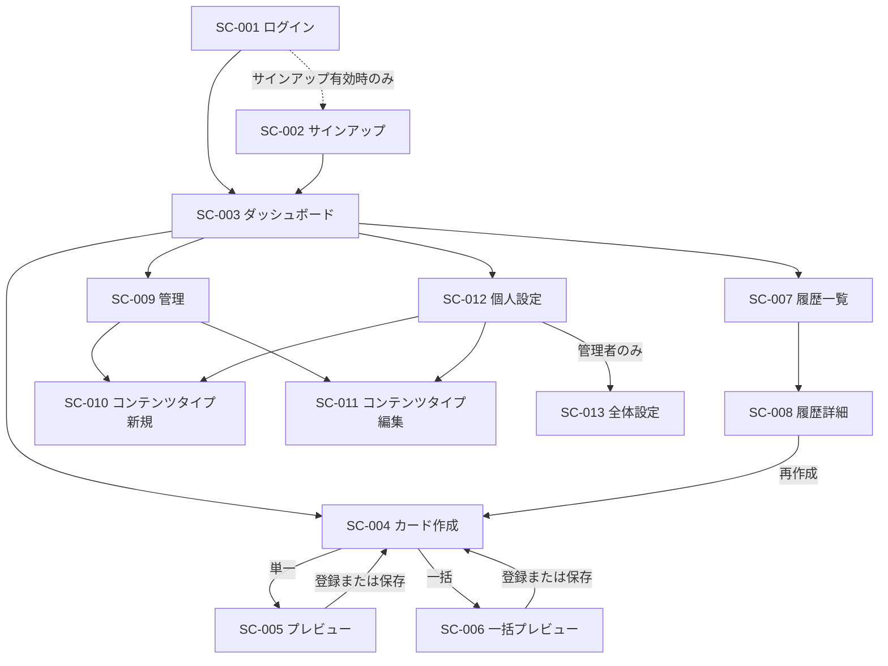
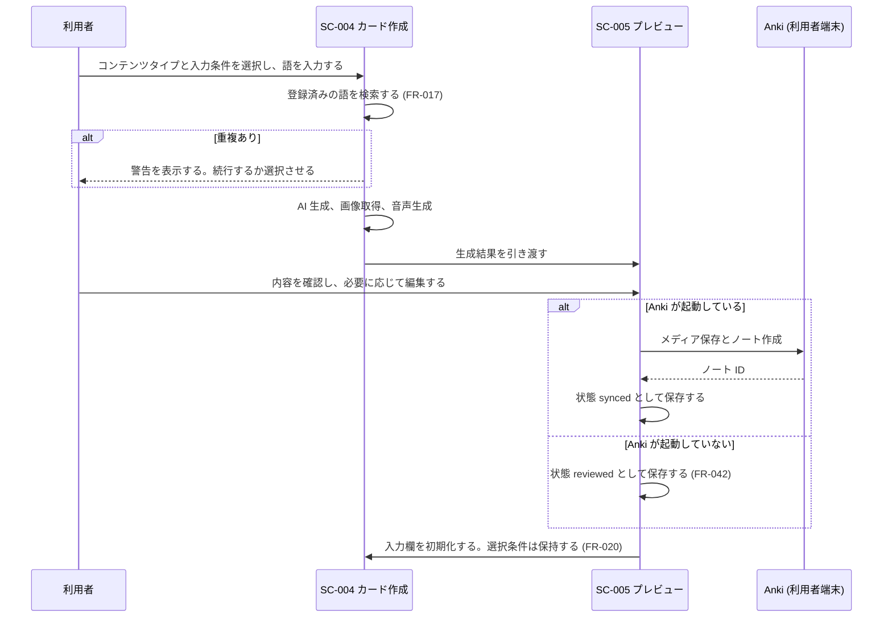

# 画面設計書 — AnkiFlow

| 項目 | 内容 |
| --- | --- |
| 文書ID | AF-SCR-001 |
| 版数 | 1.0 |
| 作成日 | 2026-08-01 |
| 最終更新日 | 2026-08-01 |
| 作成者 | [hong-quyen](https://github.com/quyen-doth) |
| ステータス | 運用中 |
| 関連文書 | AF-REQ-001、AF-UI-001、AF-ARC-001、AF-CRD-001 |

## 1. 本書の位置づけ

本書は、AnkiFlow の画面一覧、画面遷移、および各画面が担う要件を定義する。要件定義書 (AF-REQ-001) 第 8 章から委譲された内容である。

視覚設計 (配色、書体、余白、コンポーネントの見た目) はデザインシステム (AF-UI-001) に定める。本書は**どの画面が存在し、何を担い、どこへ遷移するか**のみを扱う。両者が食い違う場合、画面の存在と遷移については本書を、見た目については AF-UI-001 を正とする。

本書は前身である `docs/PRD.md` 第 8.3 節「画面リストと操作フロー」および第 8.4 節「Screen-to-Component Mapping」を引き継いだものである。旧文書には現在存在しない画面 (アプリ内スタイルガイド) が記載されていた一方、その後追加された画面 (ログイン、サインアップ、一括プレビュー、コンテンツタイプ編集、全体設定) が欠けていたため、本書では実装を正として一覧を作り直した。

## 2. 画面一覧

画面には `SC-nnn` の識別子を付与する。認証欄の「必須」は、`__session` クッキーを持たない場合にログイン画面へ誘導されることを意味する。

| 画面ID | 画面名 | ルート | 認証 | 担う要件 |
| --- | --- | --- | --- | --- |
| SC-001 | ログイン | `/login` | 不要 | FR-001 |
| SC-002 | サインアップ | `/signup` | 不要 | FR-005 |
| SC-003 | ダッシュボード | `/dashboard` | 必須 | FR-054 |
| SC-004 | カード作成 | `/create` | 必須 | FR-010〜FR-020 |
| SC-005 | プレビュー (単一) | `/preview` | 必須 | FR-030〜FR-033、FR-040〜FR-042 |
| SC-006 | プレビュー (一括) | `/preview/batch` | 必須 | FR-018、FR-034、FR-040〜FR-042 |
| SC-007 | 履歴一覧 | `/history` | 必須 | FR-050、FR-053 |
| SC-008 | 履歴詳細 | `/history/[id]` | 必須 | FR-051〜FR-053、FR-043、FR-044 |
| SC-009 | 管理 (マスターデータ) | `/admin` | 必須 | FR-060〜FR-064 |
| SC-010 | コンテンツタイプ編集 (新規) | `/admin/content-types/new` | 必須 | FR-062 |
| SC-011 | コンテンツタイプ編集 (既存) | `/admin/content-types/[id]` | 必須 | FR-062 |
| SC-012 | 個人設定 | `/settings` | 必須 | FR-065、FR-080、FR-083 |
| SC-013 | 全体設定 (管理者) | `/settings/admin` | 必須 + 管理者 | FR-070〜FR-072、FR-082 |
| SC-014 | 検証ダッシュボード | `/verify` | — | 開発用 |
| SC-015 | 検証詳細 | `/verify/[unitId]/[fixtureId]` | — | 開発用 |

ルート `/` は画面を持たず、`/dashboard` へ転送する。

SC-014 および SC-015 は開発時の検証専用であり、業務要件には対応しない。詳細はランタイム検証仕様書 (AF-VER-001) に定める。

## 3. 共通レイアウト

SC-003 から SC-013 までは共通のシェルを持つ。

| 領域 | 内容 |
| --- | --- |
| 左サイドバー | ロゴ、画面間のナビゲーション、Anki 接続状態、利用者情報、同期操作 |
| 上部ヘッダー | 現在位置の表示と、その画面における主操作 |
| 本体 | 各画面の内容 |

SC-001 および SC-002 はサイドバーを持たない専用のレイアウトを用いる。

Anki 接続状態の表示は、利用者の端末で AnkiConnect が応答するかどうかを示す。応答しない場合、その原因が Anki の未起動であるか CORS 設定の不足であるかをブラウザから判別できないため、両方の可能性を案内する。

## 4. 画面遷移

### 4.1 全体

サイドバーからは SC-003、SC-004、SC-007、SC-009、SC-012 へ直接遷移できる。上図は主要な業務上の流れを示したものであり、サイドバー経由の遷移は省略している。

### 4.2 カード作成の流れ

## 5. 各画面の要件

### 5.1 SC-001 ログイン

メールアドレスとパスワードで認証する。認証に成功すると httpOnly セッションクッキーが発行され、SC-003 へ遷移する。

サインアップへの導線は、公開サインアップが有効な場合にのみ表示する。

### 5.2 SC-002 サインアップ

公開サインアップが有効な場合にのみ機能する。無効時はサーバー側で拒否する。

アカウント作成に成功した時点で、新規利用者向けの既定マスターデータとコンテンツタイプが当該利用者のワークスペースへ複製される (FR-004)。

### 5.3 SC-003 ダッシュボード

作成状況の統計、直近の作成履歴、および主要な操作への導線を表示する。統計は当該利用者のデータのみを対象とする。

### 5.4 SC-004 カード作成

表示する入力項目は、選択したコンテンツタイプの定義から動的に構築する。画面側で項目を固定的に持たない。

単一作成と一括作成を切り替えられる。一括作成では複数の語をまとめて入力し、SC-006 へ遷移する。

入力条件のうち永続化対象として宣言された項目は、生成成功後も保持する。保持の対象はコンテンツタイプごとに独立して記録する。

入力語から学習言語を推定した場合は、確認を求めたうえで反映する (FR-012)。

### 5.5 SC-005 プレビュー

生成結果を表示し、各項目を編集できる。カードの表裏を切り替えて確認できる。画像は差し替えおよび自動リサイズに対応する。

表示するカードは、選択中のカードタイプの定義に従って組み立てる。組み立て処理は Anki への書き出しと同一であり、差異は音声ブロックの表現のみである。詳細はカードテンプレート仕様書 (AF-CRD-001) 第 7 章に定める。

登録または保存の完了後は SC-004 へ戻る。

### 5.6 SC-006 プレビュー (一括)

複数件の生成結果を一覧として扱う。各件を個別に確認・編集でき、不要な件は破棄できる (FR-034)。登録は一括で行う。

### 5.7 SC-007 履歴一覧

作成済みのエントリを一覧表示する。コンテンツタイプ、言語、状態、カテゴリ、および語による絞り込みに対応する。個別削除および一括削除を行える。

### 5.8 SC-008 履歴詳細

1 件のエントリの全項目と、生成されるカードを表示する。内容を編集して Anki へ反映でき (FR-043)、Anki 上のノートを削除できる (FR-044)。同じ条件で再作成する導線を持つ。

### 5.9 SC-009 管理

カテゴリ、カードタイプ、トピック、デッキ、およびコンテンツタイプを管理する。いずれも当該利用者のワークスペース内のデータを対象とする。

管理者は、新規利用者向けの既定データを編集する対象へ切り替えられる (FR-071)。

### 5.10 SC-010・SC-011 コンテンツタイプ編集

コンテンツタイプ 1 件を専用の画面で編集する。左側で基本情報と入力項目を、右側で AI 出力プロファイルと試験生成を扱う。画面幅が狭い場合は 1 列で表示する。

画面下端に操作バーを固定し、長い入力の途中でも保存および取り消しに到達できるようにする。未保存の変更がある状態で離脱しようとした場合は確認する。

遷移元 (SC-009 または SC-012) に応じて、現在位置の表示と戻り先を切り替える。

読み込み結果に応じて、通常表示、対象が存在しない場合、および権限がない場合を区別して表示する。

コードは作成後に変更できない。ルーティングに用いるためである。

### 5.11 SC-012 個人設定

学習言語、AI 出力言語、カードの表示に関する設定、外部連携の状態、および LINE 連携を扱う。設定は当該利用者にのみ適用される。

### 5.12 SC-013 全体設定 (管理者)

費用の発生する機能の有効・無効、使用する AI モデル、および通知の配信条件を設定する。設定は全利用者に適用される。

管理者以外は到達できない。判定はサーバー側で行い、画面の表示制御のみに依存しない。

## 6. 画面と要件の対応

要件定義書 (AF-REQ-001) 第 6 章の機能要件に対し、主たる実現画面を示す。

| 要件ID の範囲 | 主たる画面 |
| --- | --- |
| FR-001〜FR-005 | SC-001、SC-002 |
| FR-010〜FR-020 | SC-004 |
| FR-030〜FR-034 | SC-005、SC-006 |
| FR-040〜FR-044 | SC-005、SC-006、SC-008 |
| FR-050〜FR-054 | SC-003、SC-007、SC-008 |
| FR-060〜FR-065 | SC-009、SC-010、SC-011、SC-012 |
| FR-070〜FR-072 | SC-013、SC-009 |
| FR-080〜FR-083 | SC-012、SC-013 |

## 改訂履歴

| 版数 | 日付 | 変更内容 | 変更者 |
| --- | --- | --- | --- |
| 1.0 | 2026-08-01 | 初版作成。`docs/PRD.md` 第 8.3 節および第 8.4 節を引き継ぎ、実装を正として画面一覧を作り直したうえ、画面ID の付与と画面遷移図を追加した | hong-quyen |
