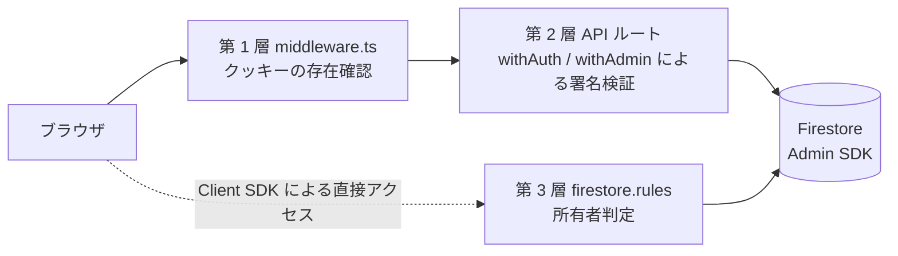

# セキュリティ設計書 — AnkiFlow

| 項目 | 内容 |
| --- | --- |
| 文書ID | AF-SEC-001 |
| 版数 | 1.3 |
| 作成日 | 2026-08-01 |
| 最終更新日 | 2026-08-02 |
| 作成者 | [hong-quyen](https://github.com/quyen-doth) |
| ステータス | 運用中 |
| 関連文書 | AF-NFR-001、AF-ARC-001、AF-API-001、AF-DB-001 |

## 1. 本書の位置づけ

本書は、AnkiFlow における認証・認可の設計を定義する。非機能要件書 (AF-NFR-001) 第 4 章に定めたセキュリティ要件を、どの機構で実現しているかを示す。

脆弱性の報告窓口はリポジトリ直下の `SECURITY.md` に定める。本書は設計文書であり、報告手順は扱わない。

本書と実装が食い違う場合は実装を正とし、本書を改訂すること。とりわけ `firestore.rules` はクライアントアクセスの唯一の拠り所であり、本書の記述より優先される。

## 2. 脅威と対策の対応

| # | 脅威 | 対策 | 実現箇所 |
| --- | --- | --- | --- |
| T-1 | 未認証の利用者が業務データへ到達する | セッションクッキーによる保護を多層で実施する | `middleware.ts`、`lib/auth-guard.ts`、`firestore.rules` |
| T-2 | 認証済みの利用者が他人のデータを参照・変更する | API は所有者スコープを自ら強制し、Client SDK の直接アクセスは Rules で遮断する | 各 API ルート、`firestore.rules` |
| T-3 | クッキーを窃取して成り済ます | httpOnly クッキーを用い、JavaScript から読めなくする | `POST /api/auth/session` |
| T-4 | ログアウト後の古いクッキーを再利用する | 検証時に失効を確認する | `verifySessionCookie(cookie, true)` |
| T-5 | 一般利用者が管理者機能を実行する | サーバー側とルールの双方で独立に判定する | `withAdmin`、`firestore.rules` の `isAdmin()` |
| T-6 | 外部連携・定期実行の窓口を第三者が叩く | セッションとは別の共有シークレットで保護する | `verifyStaticToken` |
| T-7 | 共有シークレットの比較時間から値を推測する | 時間一定比較を用いる | `timingSafeEqual` |
| T-8 | 意図せず第三者がアカウントを作成する | 公開サインアップを既定で無効とする | `SIGNUP_ENABLED` |
| T-9 | 外部サービスの資格情報が漏洩する | サーバー側でのみ保持し、クライアントへ配布しない | 各 API ルート |
| T-10 | LINE の Webhook を偽装される | 署名を検証する | `/api/notifications/line-webhook` |

## 3. 認証

### 3.1 方式

認証は Firebase Authentication のメールアドレスとパスワードによる。外部 ID プロバイダには対応しない。

ログインに成功すると、ブラウザが取得した Firebase ID トークンを `POST /api/auth/session` へ送り、サーバーがセッションクッキー `__session` を発行する。クッキーは httpOnly であり、ブラウザの JavaScript から読み取れない。

ログアウトは `DELETE /api/auth/session` で行う。サーバーはリフレッシュトークンを失効させたうえでクッキーを削除する。

### 3.2 公開サインアップの制御

`SIGNUP_ENABLED` はサーバー側でのみ参照する fail-closed のゲートである。明示的に文字列 `true` である場合にのみ有効となり、未設定・`false`・不正値のいずれでも無効として扱う。

無効時は、ログイン画面の作成リンクを表示せず、`/signup` に停止の案内を示し、`POST /api/auth/signup` は Firebase を呼び出す前に 403 を返す。既存利用者のログインには影響しない。

画面側の制御のみに依存しない。API 側で拒否することが本質であり、画面の制御は利便性のためである。

## 4. 多層防御

認証は 3 層で構成する。各層は独立しており、いずれか 1 層を通過しても他の層で遮断される。

### 4.1 第 1 層 — ミドルウェア

`middleware.ts` はクッキー `__session` が**存在するか**のみを確認する。署名は検証しない。Firebase Admin SDK が Edge Runtime 上で動作しないためである。

したがって、**偽造したクッキーはこの層を通過する**。これは設計上の想定であり、実際の検証は第 2 層が担う。

クッキーがない場合の挙動を経路によって分ける。`/api/*` に対しては 401 の JSON を返し、画面に対しては `/login` へ転送する。クライアントの `fetch` が HTML の転送応答を受け取ると、原因の分かりにくい失敗になるためである。

次の経路は対象から除外する。いずれもセッションクッキーを持たずに呼ばれるものであり、各自が別の手段で自衛する。

| 除外する経路 | 理由 |
| --- | --- |
| `/api/auth/*` | セッションがない状態でログイン・サインアップ・ログアウトを実行する必要がある |
| `/api/notifications/line-webhook` | LINE プラットフォームが外部から呼ぶ。署名検証で自衛する |
| `/api/integrations/*` | 外部システムが呼ぶ。`x-integration-token` で自衛する |
| `/api/cron/*` | 定期実行が呼ぶ。`Authorization: Bearer` で自衛する |
| `/verify` | 開発時のみ利用する。本番では応答しない |
| 静的ファイル | 保護対象ではない |

### 4.2 第 2 層 — API ルート

`lib/auth-guard.ts` が担う。リクエストごとにクッキーの署名を検証し、あわせて失効の有無を確認する。

| 関数 | 用途 | 失敗時 |
| --- | --- | --- |
| `verifySessionUser` | クッキーを検証して UID とメールアドレスを得る | `null` を返す |
| `withAuth` | 一般ルートを包む。ハンドラへ UID を渡す | 401 |
| `withAdmin` | 管理者ルートを包む。セッションのメールアドレスと `ADMIN_EMAIL` を照合する | 未認証は 401、非管理者は 403 |
| `verifyStaticToken` | 外部連携・定期実行の共有シークレットを照合する | `false` を返す |

UID はリクエストヘッダーではなく、ハンドラの引数として渡す。Next.js のルートハンドラではリクエストヘッダーが変更不可であるためである。

失効の確認 (`checkRevoked`) を有効にしているため、ログアウト後の古いクッキーは直ちに無効となる。

`verifyStaticToken` は、長さを先に比較したうえで `timingSafeEqual` を用いる。`timingSafeEqual` は長さが異なると例外を送出するため、長さ比較は例外の回避と、比較時間からの推測の防止を兼ねる。

### 4.3 第 3 層 — Firestore Security Rules

クライアントは Firebase Client SDK を用いて Firestore を直接読み書きする。この経路は第 1 層と第 2 層を通過しないため、`firestore.rules` が最後の防壁となる。ルールがなければ、誰でも他の利用者のデータを直接問い合わせられる。

Admin SDK (サーバー側の API ルート) はルールをすべてバイパスする。サーバーが `settings/global` へ書き込んだり、既定データを投入したりできるのはこのためである。

## 5. データ分離

### 5.1 原則

利用者ごとの現行コレクション (`entries`、`categories`、`card_types`、`topics`、`decks`、`user_content_types`、`review_events`) は、各ドキュメントが Firebase Auth UID を値とする `user_id` を持つ。旧 `notification_triggers` は廃止済みであり、現行の所有者付きコレクションには含めない。

所有者の確認方法は、SDK と問い合わせの形の 2 軸で分かれる。
**Rules が適用される Client SDK と、Rules をバイパスする Admin SDK を混同してはならない。**

| SDK | コレクションに対する検索 | ドキュメント ID による単一取得 |
| --- | --- | --- |
| Client SDK | `where('user_id', '==', uid)` で絞り込み、query 全体が Rules を満たすようにする | Rules の `owns(resource)` が認可の境界である。取得後の local `user_id` 照合は UX または多層防御であり、セキュリティ境界の必須条件ではない |
| Admin SDK | Rules をバイパスするため、`where('user_id', '==', uid)` による絞り込みが必須 | 取得後に `user_id` と呼び出し元 UID を照合し、不一致は存在を明かさない **404** として扱う |

Client SDK の単一取得の例は `app/preview/page.tsx`、Admin SDK の単一取得の例は
`app/api/history/[id]/route.ts` の `getOwnedEntryRef()` である。

サーバー側の書き込みは `user_id` を設定し、API 自身が所有者を検証する。Admin SDK は Rules をバイパスするため、Rules をサーバー側の防御として数えてはならない。

作成時は、作成しようとするドキュメントの `user_id` が呼び出し元の UID と一致することを確認する。他人の代わりに作成することを許さないためである。

### 5.2 コレクションごとの権限

| コレクション | 読み取り | 作成 | 更新・削除 | 備考 |
| --- | --- | --- | --- | --- |
| `entries` | 所有者のみ | 不可 | 不可 | 変更はサーバー経由に限る。問い合わせ用の派生フィールドと元フィールドの整合を保つためである |
| `review_events` | 所有者のみ | 不可 | 不可 | 追記のみの復習記録。サーバーのみが書き込む |
| `decks`、`categories`、`card_types`、`topics` | 所有者、または管理者による既定データ | 同左 | 同左 | `user_id == '__defaults__'` のテンプレートは管理者が編集できる |
| `notification_triggers` | 不可 | 不可 | 不可 | 廃止済み。明示的な規則を持たず、既定の拒否が適用される |
| `user_content_types` | 所有者のみ | 所有者のみ | 所有者のみ | 更新時に `user_id` と `code` の変更を拒否する |
| `content_types` | 認証済みの全利用者 | 管理者のみ | 管理者のみ | 3 つの組み込み ID は管理者でも削除できない |
| `settings/global` | 認証済みの全利用者 | — | 管理者のみ | 機能フラグ。秘密情報ではない |
| `settings/default` | 管理者のみ | — | 管理者のみ | LINE の秘密情報を保持する |
| `settings/{uid}` | 本人のみ | — | 本人のみ | 個人設定 |
| 上記以外 | 拒否 | 拒否 | 拒否 | 既定で拒否する |

`settings` が単一のドキュメントではなく 3 種類の用途を同じコレクションに持つ点に注意を要する。Firebase の UID は 28 文字であり、`global` および `default` と衝突しない。

`notification_triggers` は旧方式の通知設定であり、現行の配信処理は参照していない。専用の規則も削除済みであり、クライアントからは既定の拒否が適用される。詳細はデータベース設計書 (AF-DB-001) を参照すること。

`line_link_codes` は表に含めていない。サーバーのみが読み書きするため規則を宣言しておらず、既定の拒否が適用される。クライアントから到達できない。

### 5.3 変更を禁じている項目

| 対象 | 禁止事項 | 理由 |
| --- | --- | --- |
| `entries` | クライアントからの一切の書き込み | 問い合わせ用の派生フィールドが元データと乖離することを防ぐ |
| `review_events` | クライアントからの一切の書き込み | 復習記録の改変を防ぐ |
| `user_content_types.user_id` | 更新による変更 | 所有権の移転を防ぐ |
| `user_content_types.code` | 更新による変更 | ルーティングキーであり、変更すると経路が重複する |
| `content_types` の組み込み 3 件 | 削除 | 新規利用者の初期データが欠落する |

`code` の変更禁止は、画面上の制御だけでなくルールでも強制する。クライアント SDK から直接書き込む経路が存在するためである。

### 5.4 既定データのテンプレート

`user_id == '__defaults__'` を持つマスターデータは、新規利用者へ複製されるテンプレートである。実在する UID ではない。管理者のみが編集でき、サインアップ時に `seedUserDefaults` が複製する。

複製は作成のみを行う。グローバルの既定を後から変更しても、既存利用者の複製は更新されない。

## 6. 管理者の判定

管理者判定は 2 系統あり、**両方を設定しなければ機能しない**。参照先が異なるためである。

| 系統 | 参照するもの | 適用範囲 | 設定方法 |
| --- | --- | --- | --- |
| サーバー側 | 環境変数 `ADMIN_EMAIL` とセッションのメールアドレスの一致 | `/api/admin/*` などの API ルート | 環境変数を設定する |
| ルール側 | ID トークンのカスタムクレーム `admin:true` | Firestore Security Rules | `scripts/set-admin-claim.ts` で付与、または `ADMIN_EMAIL` と一致するメールアドレスでのサインアップ時に自動付与 |

Firestore Security Rules は環境変数を読み取れない。したがってカスタムクレームを用いる必要がある。

カスタムクレームは ID トークンに埋め込まれるため、**付与後に再ログインしなければ反映されない**。

`NEXT_PUBLIC_ADMIN_EMAIL` は管理者向け画面の表示制御にのみ用いる。ブラウザへ配布される値であり、セキュリティ機構ではない。この値だけを頼りに保護してはならない。

片方のみを設定した場合の挙動を次に示す。いずれも中途半端な状態であり、避けなければならない。

| 状態 | 結果 |
| --- | --- |
| `ADMIN_EMAIL` のみ設定 | API は通るが、クライアントからの既定データ編集がルールで拒否される |
| クレームのみ付与 | クライアントからは編集できるが、管理者用 API が 403 を返す |

## 7. セッションを用いない経路

| 経路 | 認証手段 | 呼び出し元 |
| --- | --- | --- |
| `/api/notifications/line-webhook` | LINE の署名検証 | LINE プラットフォーム |
| `/api/integrations/*` | ヘッダー `x-integration-token` と `INTEGRATION_TOKEN` の時間一定比較 | 外部システム |
| `/api/cron/*` | ヘッダー `Authorization: Bearer` と `CRON_SECRET` の時間一定比較 | GitHub Actions の定期実行 |

これらはミドルウェアの対象外であり、各ルートが自身で検証する。検証を欠くと無認証の窓口になる。

`/api/integrations/*` が作成する下書きの所有者は `INTEGRATION_TARGET_UID` で固定する。外部システムに UID を指定させない。

## 8. 外部サービスの資格情報

Claude API、Google Cloud TTS、Unsplash、LINE の各資格情報はサーバー側でのみ保持する。クライアントへ配布せず、ブラウザから直接これらのサービスを呼び出さない。

`NEXT_PUBLIC_` を接頭辞に持つ変数はビルド時にブラウザへ埋め込まれる。秘匿すべき値を置いてはならない。現在この接頭辞で公開しているのは、Firebase のクライアント構成、管理者判定用の表示制御、および LINE 公式アカウントの公開情報のみである。

LINE のアクセストークンは `settings/default` にも保持する。当該ドキュメントは管理者以外が読めないようルールで保護している。

## 9. 既知の制約

| # | 制約 | 影響 |
| --- | --- | --- |
| 1 | ミドルウェアは署名を検証しない | 偽造クッキーが第 1 層を通過する。第 2 層で遮断されるため実害はないが、第 1 層を認証とみなしてはならない |
| 2 | カスタムクレームの反映に再ログインを要する | 管理者権限の付与直後は権限が効かない |
| 3 | 管理者判定が 2 系統ある | 片方のみの設定が中途半端な状態を生む |
| 4 | Admin SDK はルールをバイパスする | サーバー側ルートの絞り込み漏れはデータ分離の破綻に直結する。ルールが救ってくれない |
| 5 | 監査ログを持たない | 誰がいつ何を変更したかを追跡できない |

制約 4 は最も重い。新しいサーバールートを追加する際は、`user_id` による絞り込みと所有権の確認を必ず実装すること。

<!-- TODO(user): 監査ログの要否を判断すること。個人利用の範囲では不要と考えられるが、利用者を増やす場合は検討対象となる。 -->

## 10. 変更時の注意

| 変更内容 | 必要な対応 |
| --- | --- |
| コレクションを追加する | `firestore.rules` に規則を追加し、明示的な承認を得てから反映する。既定は拒否であるため、追加しなければクライアントから読み書きできない |
| 問い合わせの条件を変える | ルールが許可する形と一致しているかを確認する |
| サーバールートを追加する | `withAuth` または `withAdmin` で包む。Admin SDK のコレクション検索は `user_id` で絞り、ID 単一取得は取得後に所有者を照合する |
| 管理者の判定箇所を変える | 2 系統の双方を同時に更新する |

Security Rules の反映は影響が大きい。誤ると全利用者の読み書きが停止する。反映前に内容を確認し、明示的な承認を得ること。

## 改訂履歴

| 版数 | 日付 | 変更内容 | 変更者 |
| --- | --- | --- | --- |
| 1.3 | 2026-08-02 | Client/Admin SDK とコレクション検索/ID 単一取得の 2 軸で認可境界と所有者照合責務を明確化 | hong-quyen |
| 1.2 | 2026-08-02 | Admin SDK が Rules をバイパスする境界を所有者分離の記述へ反映し、ID 単一取得の照合方法と廃止済み `notification_triggers` の拒否状態を明確化 | hong-quyen |
| 1.1 | 2026-08-01 | コレクション検索とドキュメント ID による単一取得で所有者の確認方法が異なることを明記。`notification_triggers` に現行の読み書きがないこと、および `line_link_codes` の扱いを追記 | hong-quyen |
| 1.0 | 2026-08-01 | 初版作成。`docs/02-design/ARCHITECTURE.md` の認証節を引き継ぎ、`firestore.rules`、`middleware.ts`、`lib/auth-guard.ts` の実装を正として脅威対応・多層防御・データ分離・管理者判定を記述した | hong-quyen |
